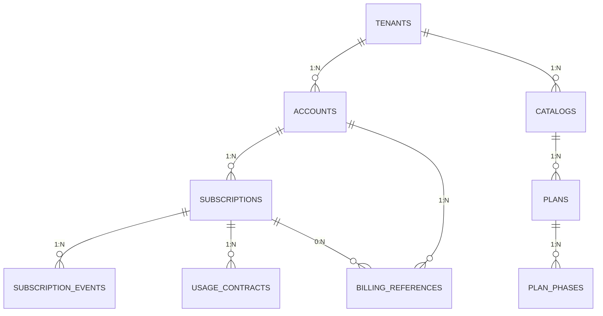
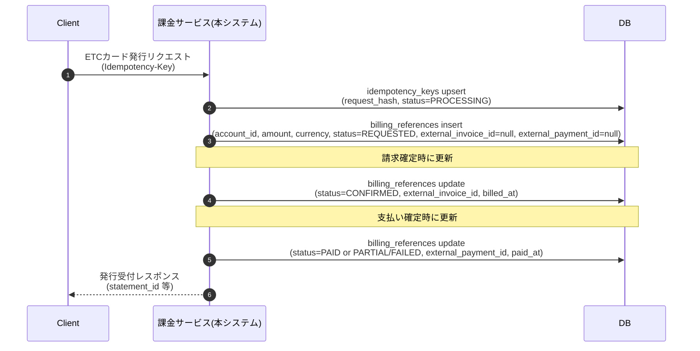

このマイクロサービスでは、我々が開発しているプレジデントカードやアップサイダーカードといった法人向け、クレジットカードにおけるカードの決済金額以外の課金情報を管理するための基盤である。具体的には、年会費やカードの発行、手数料カードの利用特典である。ラウンジ利用料等を管理するための基盤である また各プロダクトのプラン情報や提供している。サービス、例えばETCカードやラウンジ利用などといったカタログのマスター情報的なものもここで管理する予定である。キルビルと言うOSを参考にして作りたいがキルビルと言うOSは我々の実現したいことには少しオーバーエンジニアリングなので、必要最小限の機能だけ実装することとする。 また、最終的には、クレジットカード以外の他の社内のプロダクトからも参照されることを想定している

課金の種類としては、サブスクリプション。例えば年に1階請求される。年会費や月に1回請求される。月会費等されるなど。またnヶ月先までn回請求される、のようなパターンもある。 従量課金やワンタイム課金なども存在する。

## データモデル（ER 図）

### テーブル概要（最小構成）
- tenants: ブランド/環境ごとの論理分離（通貨・タイムゾーン既定）。
- accounts: 請求先（外部 org/account ID を unique with tenant で保持）。
- catalogs: カタログのバージョン管理（effective_from/to）。
- plans / plan_phases: プランとフェーズ（TRIAL/REGULAR 等）、期間・課金方式。
- subscriptions: 契約本体（bundle/external_key で冪等性を確保）。
- subscription_events: 変更/キャンセル/アップグレードの将来効力イベント。
- usage_contracts: 契約量（quota）や段階課金の設定。
- billing_references: 請求・支払いの最小控え（amount, currency, status, timestamps, external参照ID）。サブスク課金を紐づける場合はsubscription_idを保持。金額計算・決済処理は行わず、参照/突合のみ。
- idempotency_keys（別紙想定）: リクエスト冪等管理。
- outbox_events（別紙想定）: 外部連携用イベント配送の transactional outbox。

### 補足: 月次締めの合計保持
- 基本は `billing_references` 行の合算で計算する（cycle_key などで集計）。
- 監査や外部計算結果と突合した結果を固定したい場合だけ、任意で `billing_cycle_summaries` を導入し、`cycle_key (YYYY-MM)`, `account_id`, `total_amount`, `currency`, `status`, `billed_at`, `paid_at` を保持する。

## フロー: ETCカード発行（ワンショット課金）

ETCカード発行はサブスクリプションを作らず、この課金サービスのDBに「最小の請求/支払控え」だけを残す。

### テーブルへの書き込み・更新
- idempotency_keys: リクエスト冪等性を保持（重複実行防止）。
- billing_references: 最小の請求/支払控え。amount/currency/statusと外部参照IDのみ。
- subscriptions / subscription_events: 本ワンショット課金では未使用（サブスクを汚さない）。
